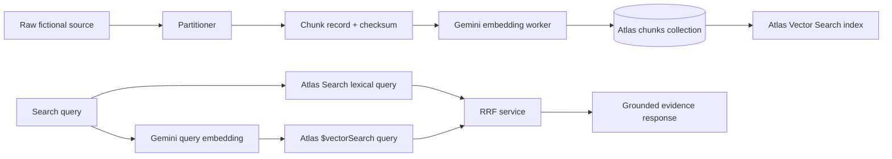
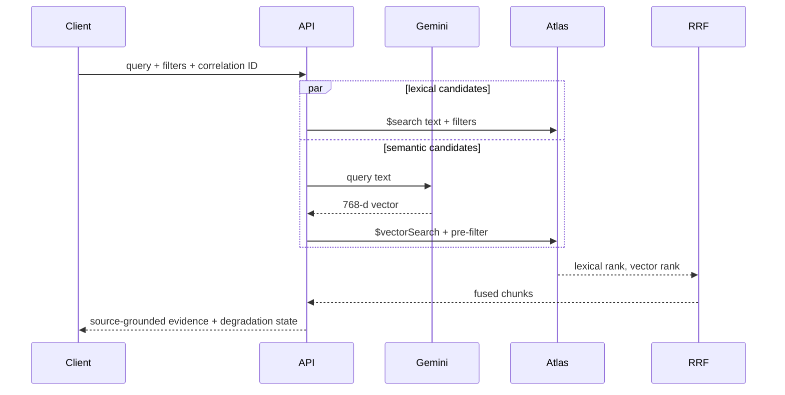
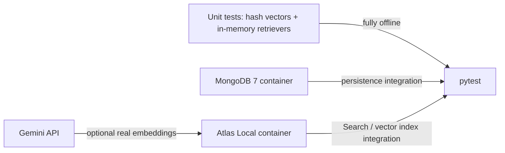

# Production semantic-hybrid retrieval with MongoDB Atlas

The runnable `examples/hybrid_retrieval_demo.py` is intentionally local: it
uses a deterministic hash embedder, `LocalVectorRetriever`, and in-memory
cosine similarity. It does **not** start MongoDB, query Atlas Vector Search, or
claim production-quality semantic relevance.



## Ingestion and indexing

1. Partition source files and upsert chunks by `chunk_id`.
2. Generate embeddings only when `content_sha256` or `embedding_version`
   changes. Store the vector, model, dimensions, version, and source checksum
   on the same chunk document.
3. Create the checked-in
   [`chunks.vector-search-index.json`](../infra/mongodb/chunks.vector-search-index.json)
   definition as a **Vector Search** index, then wait until its status is
   `Ready` before enabling vector traffic.
4. Treat a model/dimension change as a new index generation: write a new vector
   field and index, backfill it, validate it, then move the ranking configuration
   to the new index. Do not mix vectors from different embedding contracts.

Atlas requires a vector field and supports separately indexed `filter` fields
for metadata pre-filtering. The configured 768 dimensions must exactly match
the produced Gemini vector length. [MongoDB’s vector-index guidance](https://www.mongodb.com/docs/vector-search/)
describes the dimension and filter-field requirements.

## Query path

For each request, normalize and hash the query for logs, obtain one query
embedding, and launch lexical and vector candidates independently. Use the same
metadata constraints for each source before fusion.



A production-shaped vector aggregation is:

```javascript
[
  {
    $vectorSearch: {
      index: "chunk_vector_768",
      path: "embedding",
      queryVector: queryVector,
      numCandidates: 100,
      limit: 25,
      filter: {domain: "location", "metadata.region": "busan"}
    }
  },
  {$set: {vector_score: {$meta: "vectorSearchScore"}}},
  {$project: {chunk_id: 1, file_id: 1, text: 1, source_title: 1, source_url: 1,
              character_start: 1, character_end: 1, metadata: 1, vector_score: 1}}
]
```

`numCandidates` is intentionally larger than the result limit to improve
approximate-nearest-neighbor recall. Atlas requires the limit not to exceed the
candidate count; tune both with the repository’s synthetic qrels first, then
with representative production judgments. [MongoDB’s `$vectorSearch`
reference](https://www.mongodb.com/docs/manual/reference/operator/aggregation/vectorSearch/)
documents those constraints.

## Fusion, resilience, and operations

Keep the source-specific ranks—`lexical_rank` and `vector_rank`—with every
candidate, then apply RRF with a versioned `k`. Do not add or compare raw
Atlas-search and vector-search scores directly because their scales differ.

```mermaid
flowchart TD
    L[Lexical candidates] --> R{Both sources available?}
    V[Vector candidates] --> R
    R -->|yes| F[RRF: 1 / (k + rank)]
    R -->|vector timeout/index unavailable| D[Lexical fallback]
    F --> E[Evidence response]
    D --> E
    E --> O[degraded=false or degraded=true + reason]
```

Set short independent deadlines for embedding, lexical retrieval, vector
retrieval, and fusion. If vector embedding or Atlas Vector Search fails, return
the lexical candidates with `degraded: true` and a machine-readable reason;
never silently label that response as hybrid. Log a correlation ID, query hash,
filter shape, source candidate counts, stage latencies, cache status, ranking
version, and degradation reason. Monitor zero-result rate, fallback rate,
p95/p99 stage latency, and qrel metrics after every index or model migration.

## What can run locally



| Scope | Local? | External dependency |
| --- | --- | --- |
| Chunking, BM25, cosine vector ranking, RRF, qrels, and API contracts | Yes | None; use `HashEmbeddingProvider` |
| MongoDB persistence | Yes | Docker only |
| Atlas Search / Atlas Vector Search query behavior | Yes, with Atlas Local | Docker image and a local index build |
| Gemini embedding quality and quotas | No | Gemini Developer API |
| Atlas managed-cluster scale, IAM, and network behavior | No | A real Atlas project |

The current repository already runs the first two categories in CI and provides
an Atlas Local profile for text-search integration. A full local vector-DB test
would add a `LocalAtlasVectorSearchAdapter`, load `chunks.embedded.jsonl` into
the Atlas Local container, wait for `chunk_vector_768` to become ready, then
assert its `$vectorSearch` results and filter behavior. Use the hash embedder
for a fully offline contract test, or Gemini for an end-to-end semantic smoke
test; do not characterize either tiny local run as production quality.
